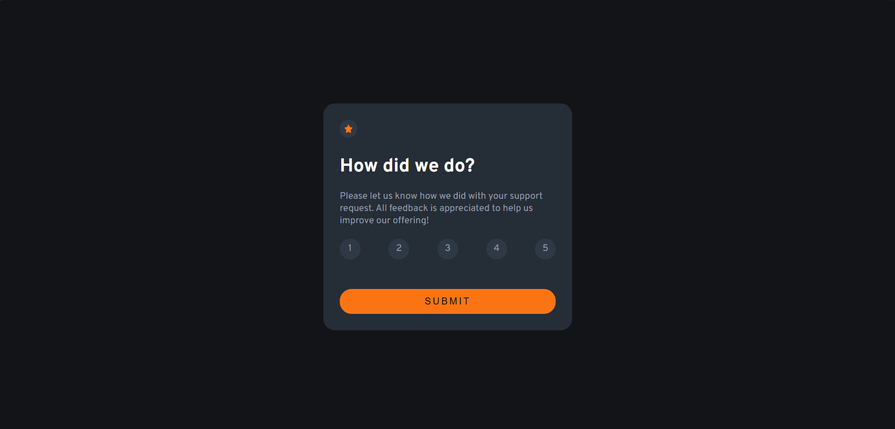
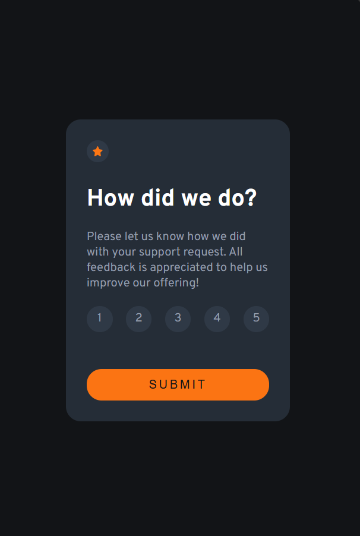
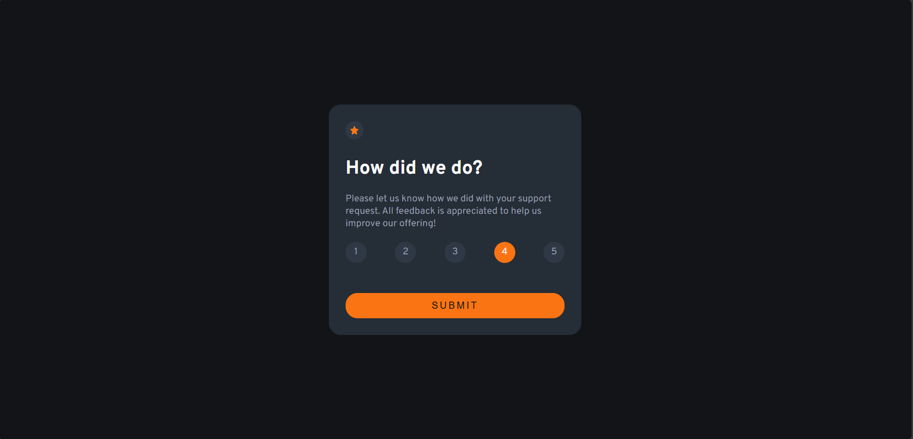

# Frontend Mentor - Interactive rating component solution

This is a solution to the [Interactive rating component challenge on Frontend Mentor](https://www.frontendmentor.io/challenges/interactive-rating-component-koxpeBUmI). 

## Table of contents

  - [Published link](#Published-link)
  - [The challenge](#the-challenge)
  - [Screenshot](#screenshot)
  - [Built with](#built-with)
  - [What I learned](#what-i-learned)
  - [Author](#author)

### Published link: https://ajinkya9834.github.io/Rating-card-practice/

### The challenge

Users should be able to:

- View the optimal layout for the app depending on their device's screen size
- See hover states for all interactive elements on the page
- Select and submit a number rating
- See the "Thank you" card state after submitting a rating

### Screenshot

- Desktop view:
  

- mobile-view:
  

- hover-state:
  

-thank-you:
  

### Built with

- HTML5 markup
- CSS3 
- javascript
- Flexbox

### What I learned

- sending text content from one html file to another html file.

## Author

- Frontend Mentor (see my other challenges) - [@Ajinkya Hajare](https://www.frontendmentor.io/profile/Ajinkya9834)
- My Linkedin profile - [@Ajinkya Hajare](www.linkedin.com/in/ajinkya-hajare)

